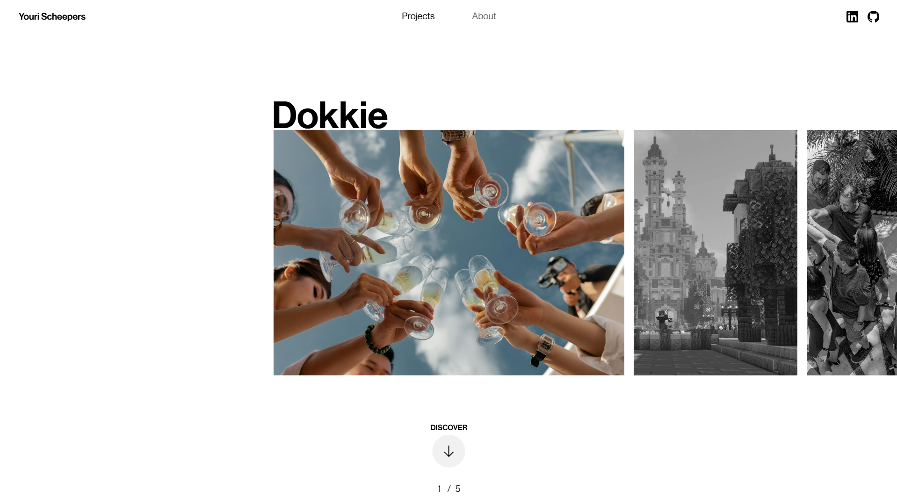
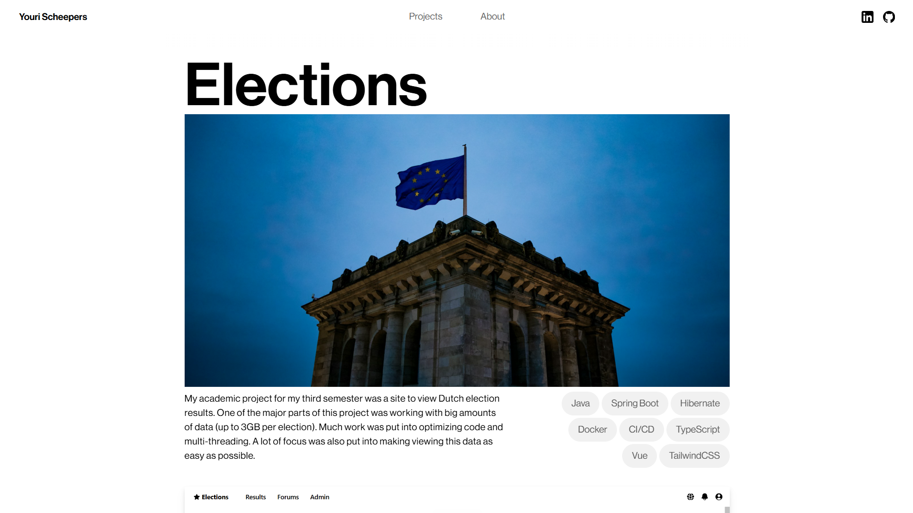
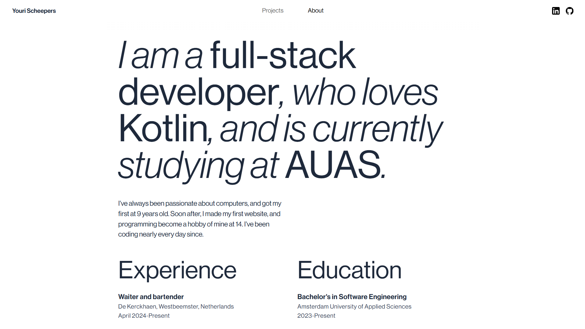

# Developer Portfolio

Welcome to my portfolio! I use this to showcase some of my previews work, my professional experience and some personality. Built using cutting-edge web technologies and designed with a clean and modern aesthetic, this portfolio represents my work as a software developer. This is the ~~first~~ second version, and knowing myself, definitely not the last.

## 🛠️ Built with
This project uses the following technologies:

- [Vite](https://vite.dev/): A lightning-fast build tool for modern web applications.
- [Vue 3](https://vuejs.org/): A progressive JavaScript framework for building user interfaces.
- [TypeScript](https://www.typescriptlang.org/): Adds type safety and developer confidence to the codebase.
- [TailwindCSS](https://tailwindcss.com/): A utility-first CSS framework for styling with speed and precision.

## 🚀 Features

- Interactive UI: Smooth transitions and animations powered by Vue 3.
- SEO Optimized: Easily discoverable on search engines like Google.
- Fast Performance: Built with Vite for quick load times.
- Code Modularization: Written in TypeScript for maintainability and scalability.
- Automatic Deployment: Using GitHub Actions to automatically deploy site to GitHub Pages.

## 🌐 Deployment
This portfolio is deployed via GitHub Pages and can be accessed at:
[www.yourischeepers.com](https://www.yourischeepers.com/)

Alternatively, just Google "Youri Scheepers," and my portfolio will appear in the search results!

## 🖼️ Screenshots

